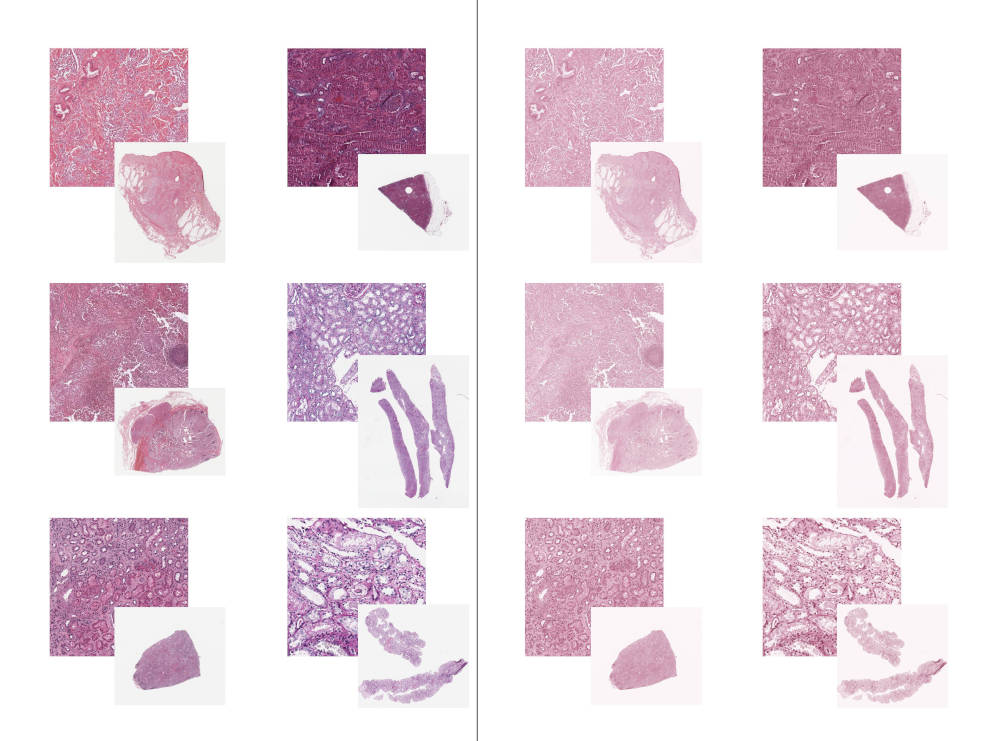
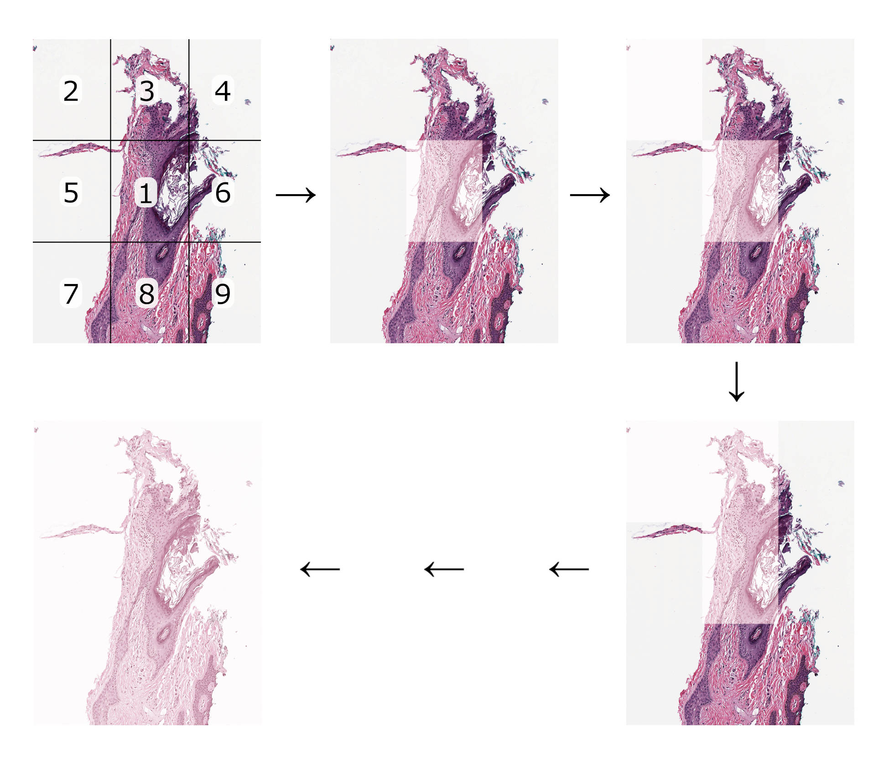

.. dogsled documentation main file

=====================================
About dogsled
=====================================

dogsled is an `open-source <https://en.wikipedia.org/wiki/Richard_Stallman#Open_source_and_Free_software>`_ Python package that does only `one <https://en.wikipedia.org/wiki/Unix_philosophy>`_ thing: Macenko :footcite:p:`Macenko2009method` stain normalisation of medical slides. It works with `OpenSlide <https://openslide.org>`_ slide formats, generates either JPEG or TIFF normalised image, and it is designed to be:

* **Simple** -- minimum input is required from the user
* **Flexible** -- dogsled supports different ways of specifying which slides have to be normalised
* **Customisable** -- the user can either use the pre-defined parameters such as normalisation constants or paths (for storing the data) or can specify different ones

|   Why *dogsled*? Well, first of all, because of the dogs. Second, because together many dogs can push a cargo too heavy for one dog to handle. Similarily, dogsled divides heavy computations into smaller ones. As with many algorithms and life situations, divide and conquer, right?

Motivation behind the development
-------------------------------------
While working on a method for segmentation and classification of all tubular structures seen in medical slides of kidneys, the author of this package has noticed a slight difference in the stain colour between the medical slides. This difference was even more apparent when slides from another laboratory were examined. As the quality of the data plays an (if not the most) important role in model development :footcite:p:`Halevy2009Unreasonable`, it has been decided to take a step back from the exciting model development and turn to the data quality enhancement. It has been identified that several different normalisation techniques exist :footcite:p:`Reinhard2001Color, Khan2014Nonlinear, Anand2019Fast`. The choice fell to the Macenko stain normalisation for its relative simplicity. However, it has also been discovered that available tools could not handle SVS slides (20,000x20,000 px an up), causing a crash when handling the data. Therefore, a tool was created which

* would not crash the system
* could normalise several slides specified
* create thumbnails for reporting

This Python package is a `slightly` refactored version of this tool with some additions and modifications, and the normalisation looks something like this:

The images on the left side are the source slides (and their corresponding 100% zoom), and on the right their normalised copies. Slides from: :footcite:p:`Bertram2019large, Bueno2020Data, Clark2013Cancer`

Quirks and features
-------------------------------------
Currently, dogsled can:

* normalise all slides located in a specified folder
* normalise slides specified by name
* normalise slides defined in a QuPath library (either all or the ones specified by name and/or index)
* generate JPEG equivalents of the normalised slides
* generate TIFF equivalents of the normalised slides (also for large slides not fitting in RAM)
* create hematoxylin/eosin decoupled normalised images
* create thumbnails of all slides (pre-normalised and normalised)

See `quickstart <quickstart.html>`__ and `API <api.html>`__ for further details.

How does it work?
-------------------------------------

dogsled is based on the Macenko normalisation implementation found `here <https://github.com/schaugf/HEnorm_python>`_ and `here <https://github.com/mitkovetta/staining-normalization/>`_. In contrast to these raw implementations, dogsled is tailored for automatic handling of many large medical slides. This is achieved by, amongst other, by processing slides in tiles. First, dogsled estimates the tile sizes suitable for the machine, and then it calculates locations of the tiles. In order to estimate the slide-specific parameters, the tile in centre of the slide is normalised first (as the probability of this tile to contain tissue is higher than containing the background). This process is illustrated in the picture above (slide from the `OpenSlide test dataset <https://openslide.cs.cmu.edu/download/openslide-testdata/Aperio/>`_). After finishing the normalisation of all tiles, they are stitched together, resulting in a normalised equivalent image of the source slide.

References
''''''''''''''''''''''''''''''''''''''

.. footbibliography::

.. toctree::
   :maxdepth: 2
   :caption: Contents:

   quickstart
   installation
   api
